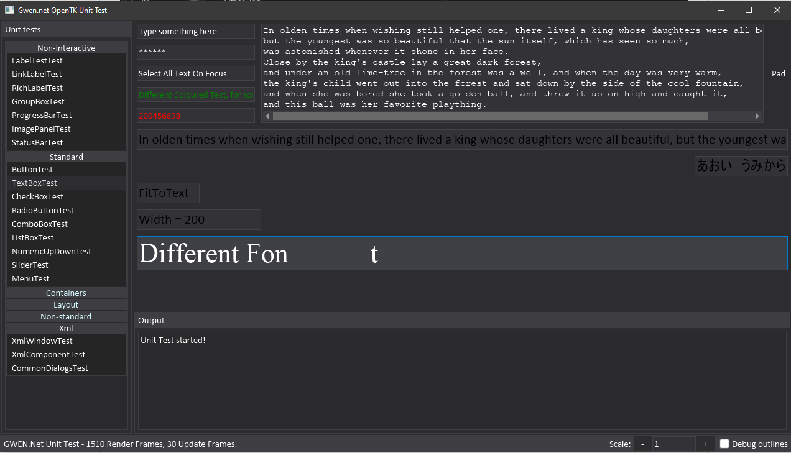

# Gwen.Net 

Gwen.Net is part of a chain of forks, tracing back to a .Net port of GWEN. 
GWEN was a lightweight GUI library aimed at games.

This specific fork is adapted to the needs of the VoxelGame project.

The included Gwen.Net.OpenTK project provides rendering and input handling, showing how to adapt Gwen.Net to a specific platform.
Note that it uses GDI+ for rendering, which is not hardware accelerated.

It looks like this: 

> Original GWEN can be found from https://github.com/garrynewman/GWEN and Gwen.Net from https://code.google.com/archive/p/gwen-dotnet
