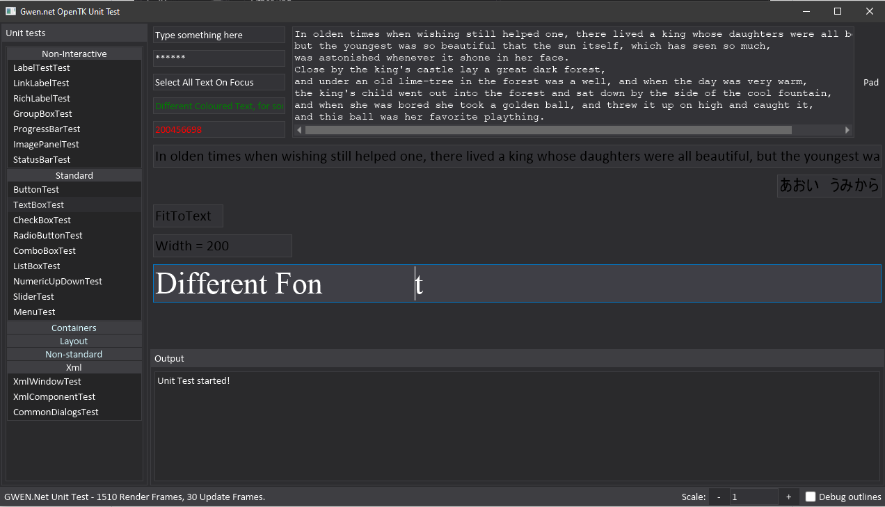

# Gwen.Net

Gwen.Net is part of a chain of forks, tracing back to a .NET port of [GWEN](https://github.com/garrynewman/GWEN).
GWEN was a lightweight GUI library aimed at games and is somewhat easy to integrate in whatever rendering setup you use.
NuGet packages of the state in this repository are available.

This specific fork was adapted to the needs of the [VoxelGame](https://github.com/jeanpmathes/VoxelGame) project.
VoxelGame no longer uses GWEN as its UI but a custom UI system that is of similar easy of use and integration as GWEN.

The included Gwen.Net.OpenTK project provides rendering and input handling, showing how to adapt Gwen.Net to a specific
platform.

It looks like this:

> Original GWEN can be found from https://github.com/garrynewman/GWEN and Gwen.Net
> from https://code.google.com/archive/p/gwen-dotnet
